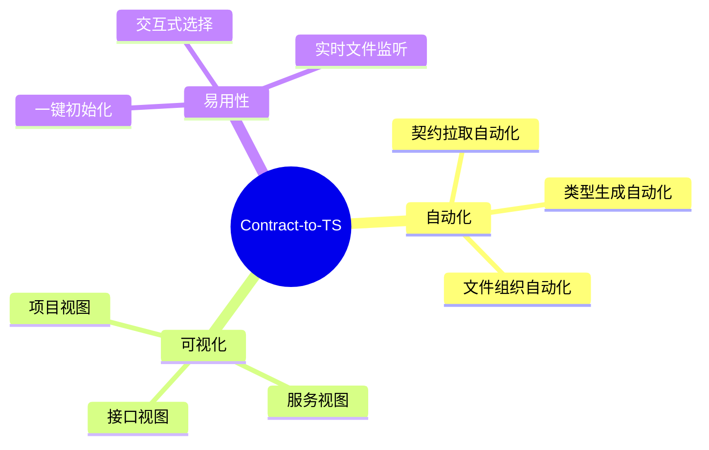

# Contract-to-TS 项目总结汇报

> 📅 汇报日期：2025年12月  
> 👤 项目负责人：zs-liu  
> 📦 项目版本：v0.0.9

---

## 一、项目背景

### 1.1 业务痛点

在日常前端开发工作中，开发团队频繁与后端服务进行接口对接。每当后端接口契约发生变更时，前端开发者需要手动同步更新 TypeScript 类型定义，这一过程存在以下核心痛点：

| 痛点           | 描述                                                         |
| -------------- | ------------------------------------------------------------ |
| ⏰ **效率低下** | 手动编写和维护接口类型定义耗时耗力，尤其是复杂嵌套结构的接口 |
| ⚠️ **易出错**   | 人工转换容易出现类型遗漏、字段命名不一致等问题               |
| 🔄 **同步困难** | 接口版本迭代时，难以及时追踪变更并更新本地类型定义           |
| 📁 **管理混乱** | 多项目、多服务下的接口类型文件缺乏统一的组织结构             |
| 🔗 **平台割裂** | MOM 契约管理平台与开发 IDE 之间缺乏直接的连通桥梁            |

### 1.2 解决思路

基于上述痛点分析，决定开发一款 **VS Code 扩展插件**，实现：

- 🔌 **平台直连**：与 MOM 契约管理平台 API 直接对接
- 🤖 **自动生成**：基于契约模型自动生成符合规范的 TypeScript 类型定义
- 📊 **可视化管理**：在 IDE 侧边栏提供直观的接口管理视图
- 🔄 **实时同步**：支持一键更新接口，保持类型定义与平台契约一致

---

## 二、开发目标

### 2.1 核心目标



### 2.2 功能矩阵

| 功能模块       | 功能点                                    | 优先级 | 状态 |
| -------------- | ----------------------------------------- | ------ | ---- |
| **项目初始化** | 配置类型文件保存目录                      | P0     | ✅    |
| **接口添加**   | 搜索项目 → 选择版本 → 选择接口 → 生成类型 | P0     | ✅    |
| **接口管理**   | 查看接口详情                              | P1     | ✅    |
| **接口管理**   | 更新接口类型                              | P1     | ✅    |
| **接口管理**   | 删除接口                                  | P1     | ✅    |
| **接口管理**   | 跳转平台链接                              | P2     | ✅    |
| **视图展示**   | 树形结构展示（项目-服务-接口）            | P0     | ✅    |
| **文件监听**   | 实时监听类型文件变化并刷新视图            | P1     | ✅    |

---

## 三、实施过程与技术细节

### 3.1 整体架构

```
┌────────────────────────────────────────────────────────────────┐
│                        VS Code Extension                        │
├─────────────────────────┬──────────────────────────────────────┤
│        Commands         │          Views (TreeView)            │
│       ───────────       │         ───────────────              │
│       • init            │         • ProjectItem                │
│       • addInterface    │         • ServiceItem                │
│       • update          │         • InterfaceItem              │
│       • delete          │                                      │
│       • view            │                                      │
└───────────┬─────────────┴──────────────────┬───────────────────┘
            │                                │
            ▼                                ▼
┌───────────────────┐  ┌───────────────┐  ┌──────────────────────┐
│      Service      │  │   Generator   │  │     File System      │
│     ──────────    │  │  ───────────  │  │    ─────────────     │
│     MOM API       │  │ WriterFactory │  │  • 类型文件读写       │
│     接口调用      │  │   TSWriter    │  │  • 配置文件管理       │
└─────────┬─────────┘  └───────┬───────┘  └──────────────────────┘
          │                    │
          ▼                    ▼
┌────────────────────────────────────────────────────────────────┐
│                      MOM 契约管理平台                           │
│             contract.mobile.flight.ctripcorp.com               │
└────────────────────────────────────────────────────────────────┘
```

### 3.2 核心任务实现

#### 3.2.1 TypeScript 类型生成器

类型生成器是本插件的核心引擎，负责将 MOM 平台的契约模型转换为 TypeScript 类型定义。

**设计模式：工厂模式 + 责任链**

```typescript
// GeneratorFactory.ts - 工厂模式创建生成器
class GeneratorFactory {
  static generate(param, options, generateOptions) {
    // 1. 创建对应语言的 Writer
    var writer = GeneratorFactory.WriterFactory.create(param.lang);
    
    // 2. 解析请求/响应模型
    root.children.forEach(function (item) {
      if (model.id === service_info.requestModelId) req = item;
      if (model.id === service_info.responseModelId) resp = item;
    });
    
    // 3. 调用 Writer 生成代码
    writer.writeRequest(req);
    writer.writeResponse(resp, param);
    writer.writeCacheType();  // 处理缓存的复杂类型
    
    return writer.toString();
  }
}
```

**类型映射策略**

| 契约类型                       | TypeScript 类型     | 备注             |
| ------------------------------ | ------------------- | ---------------- |
| `string`                       | `string`            | 直接映射         |
| `boolean`                      | `boolean`           | 直接映射         |
| `integer`/`int`/`long`/`short` | `number`            | 数值类型统一映射 |
| `float`/`double`/`decimal`     | `number`            | 浮点类型映射     |
| `datetime`/`date`/`time`       | `string`            | 日期类型转字符串 |
| `binary`                       | `number[]`          | 二进制转数组     |
| 复杂类型                       | `interface`         | 递归生成接口     |
| 枚举类型                       | `enum`              | 生成 TS 枚举     |
| 列表类型                       | `T[]`               | 数组类型         |
| Map 类型                       | `{[key:string]: T}` | 索引签名         |

**关键特性**

1. **递归处理嵌套结构**：通过 `cacheComplexClass` 缓存复杂类型，避免重复生成
2. **联合类型支持**：处理 `choice` 类型生成 TypeScript 联合类型 `A | B | C`
3. **可选字段处理**：根据 `required` 字段自动添加 `?` 可选标记
4. **JSDoc 注释生成**：保留契约中的字段注释信息

#### 3.2.2 Tree View 可视化管理

采用 VS Code TreeView API 构建三层树形结构：

```
📁 Project (项目)
  └── ☁️ Service (服务)
        └── 🔷 Interface (接口)
```

**核心类设计**

```typescript
// TreeDataProvider.ts - 数据提供者
class MyTreeDataProvider implements TreeDataProvider<TreeItem> {
  // 事件驱动的刷新机制
  private _onDidChangeTreeData: EventEmitter<TreeItem | undefined>;
  
  // 层级化获取子节点
  getChildren(element?: TreeItem) {
    if (!element) return this.getProjectsInfo();      // 根节点：项目列表
    if (element instanceof ProjectItem) 
      return element.getChildren();                    // 项目下：服务列表
    if (element instanceof ServiceItem) 
      return element.getChildren();                    // 服务下：接口列表
  }
}

// ProjectItem.ts - 项目节点
class ProjectItem extends TreeItem {
  getChildren() {
    // 读取类型目录，解析 interfaceInfo.json 构建服务-接口映射
    readdirSync(typeRootPath)
      .filter(/* 过滤有效目录 */)
      .forEach((intfDir) => {
        const interfaceInfo = JSON.parse(readFileSync(infoPath));
        // 按 serviceCode 分组
        serviceMap.get(serviceCode).addInterface(new InterfaceItem(...));
      });
    return Array.from(serviceMap.values());
  }
}
```

**文件监听机制**

```typescript
// 实时监听类型文件目录变化
doProjectWatch() {
  const watcher = workspace.createFileSystemWatcher(`${typesRootPath}/**/*`);
  watcher.onDidChange(() => this.ctx.refresh());
  watcher.onDidCreate(() => this.ctx.refresh());
  watcher.onDidDelete(() => this.ctx.refresh());
}
```

#### 3.2.3 MOM 平台 API 封装

封装了与 MOM 契约平台的全部交互接口：

```typescript
// service/index.ts
export const getProjectList = async (keywords: string) => {...}
export const getProjectVersionList = async (projectId: number) => {...}
export const getInterfaceList = async ({projectId, version}) => {...}
export const getInterfaceModels = async (methodId, methodName) => {...}
export const getServiceInfo = async ({projectId, version, methodName}) => {...}
```

**认证机制**

```typescript
// 通过 VS Code 配置读取 accessToken
const getAccessToken = () => {
  return getConfig('contract-to-ts.accessToken') as string || '';
};

// 创建带认证头的 API 实例
const createAPIWithToken = (baseURL: string) => {
  return axios.create({
    headers: { 'access-token': getAccessToken() },
    baseURL,
  });
};
```

### 3.3 问题解决

#### 问题1：复杂嵌套类型的循环依赖

**问题描述**：当接口模型存在循环引用（如 A → B → A）时，递归生成会导致栈溢出。

**解决方案**：引入类型缓存机制

```typescript
// 使用 Map 缓存已处理的类型
self.__ComplexClassDic = {};
self.__ComplexClassList = [];

self.cacheComplexClass = function(data) {
  if (this.__ComplexClassDic[name]) return;  // 已缓存则跳过
  this.__ComplexClassList.push(data);
  this.__ComplexClassDic[name] = 1;
}

// 最后统一生成缓存的类型
self.writeCacheType = function() {
  while ((node = self.__ComplexClassList.pop())) {
    self.writeComplexType(node, 0);
  }
}
```

#### 问题2：多项目工作区支持

**问题描述**：VS Code 支持多根工作区，需要同时管理多个项目的接口。

**解决方案**：扫描所有 `package.json`，根据 `contractToTSConfig` 配置识别项目

```typescript
export const getProjectsInfo = async () => {
  const excludePatterns = '**/{node_modules,dist,publish}/**';
  const projectPaths = await workspace.findFiles('**/package.json', excludePatterns);
  const projects = await Promise.all(projectPaths.map(getProjectInfo));
  return projects.filter(p => !!p.config);  // 只返回配置了插件的项目
}
```

#### 问题3：接口版本管理

**问题描述**：同一接口可能存在多个版本，用户需要灵活选择目标版本。

**解决方案**：提供两种更新策略

```typescript
// 配置项：直接更新到最新版 / 用户选择版本
const updateType = workspace.getConfiguration('zt-mom-ts')
  .get<InterfaceUpdateType>('directUpateType');
const userPick = updateType === 'chooseVersion';

await momIntf.update(userPick);  // 根据配置决定是否展示版本选择器
```

#### 问题4：类型文件与元数据同步

**问题描述**：需要同时存储生成的 TS 类型文件和接口元信息（用于后续更新）。

**解决方案**：双文件存储策略

```
📁 GetFlightInfo/
  ├── index.ts           # 生成的 TypeScript 类型定义
  └── interfaceInfo.json # 接口元数据（projectId, serviceCode, methodId 等）
```

```typescript
// 同时写入类型文件和元数据
await workspace.fs.writeFile(
  Uri.joinPath(this.typeFileDir, 'index.ts'),
  Buffer.from(code)
);
await workspace.fs.writeFile(
  Uri.joinPath(this.typeFileDir, 'interfaceInfo.json'),
  Buffer.from(JSON.stringify(interfaceInfo, null, 2))
);
```

---

## 四、产出与收益

### 4.1 项目产出

| 产出项           | 说明                                                  |
| ---------------- | ----------------------------------------------------- |
| **VS Code 插件** | `contract-to-ts` v0.0.9，已发布至 VS Code Marketplace |
| **技术文档**     | README.md 使用指南                                    |
| **代码规模**     | TypeScript 代码约 2000+ 行                            |

### 4.2 功能特性总结

```
┌─────────────────────────────────────────────────────────────┐
│                    Contract-to-TS 功能全景                   │
├─────────────────────────────────────────────────────────────┤
│  🔧 核心功能                                                 │
│  ├── 接口契约拉取：从 MOM 平台获取接口定义                    │
│  ├── TS 类型生成：自动生成标准 TypeScript Interface          │
│  ├── 文件组织管理：按项目-服务-接口组织文件结构               │
│  └── 实时文件监听：自动刷新视图                              │
├─────────────────────────────────────────────────────────────┤
│  📁 视图管理                                                 │
│  ├── 项目视图：展示已配置的项目列表                          │
│  ├── 服务视图：按服务号分类展示接口                          │
│  └── 接口视图：展示接口详情、支持增删改查                    │
├─────────────────────────────────────────────────────────────┤
│  ⚙️ 配置能力                                                 │
│  ├── accessToken 配置：MOM 平台认证令牌                      │
│  ├── 类型目录配置：自定义类型文件存放路径                    │
│  └── 生成选项配置：忽略类型、命名风格等                      │
└─────────────────────────────────────────────────────────────┘
```

### 4.3 效率收益

| 指标           | 传统方式   | 使用插件后   | 效率提升  |
| -------------- | ---------- | ------------ | --------- |
| 单接口类型定义 | 15-30 分钟 | 10 秒        | **90x**   |
| 接口更新同步   | 10-20 分钟 | 3 秒         | **200x+** |
| 多接口批量添加 | 手动逐个   | 流程化操作   | 显著      |
| 错误率         | 人工易出错 | 自动生成无误 | 降至 0    |

### 4.4 技术价值

1. **前后端协作提效**：开发者无需手动维护接口类型，专注业务逻辑
2. **代码质量保障**：自动生成的类型定义规范统一，减少人为错误
3. **开发体验提升**：在 IDE 内完成全部操作，无需切换平台

### 4.5 未来规划

| 规划项        | 描述                       | 优先级 |
| ------------- | -------------------------- | ------ |
| 批量导入      | 支持一键导入服务下全部接口 | P1     |
| 接口变更检测  | 自动检测平台接口变更并提醒 | P1     |
| Mock 数据生成 | 基于类型定义生成 Mock 数据 | P2     |
| 多平台支持    | 扩展支持其他接口管理平台   | P3     |
| 国际化        | 支持中英文切换             | P3     |

---

## 五、总结

`Contract-to-TS` 项目成功解决了前端开发中接口类型定义手动维护的痛点，通过与 MOM 契约平台的深度集成，实现了从契约到 TypeScript 类型的全自动化转换。项目采用 VS Code Extension 技术栈，提供了直观的可视化管理界面。

项目的落地将显著提升团队的开发效率，减少重复劳动，并为代码质量提供类型安全保障。

---

*📝 文档版本：v1.0*  
*📅 更新时间：2025年12月25日*
